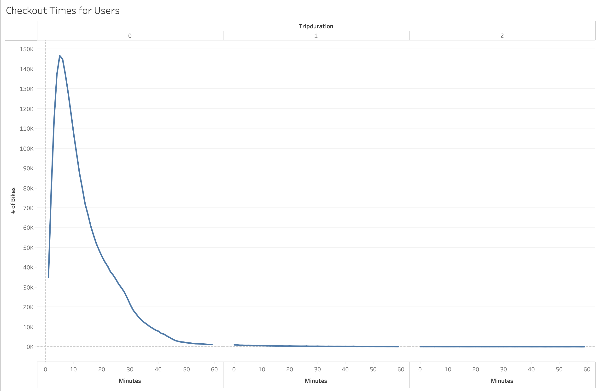
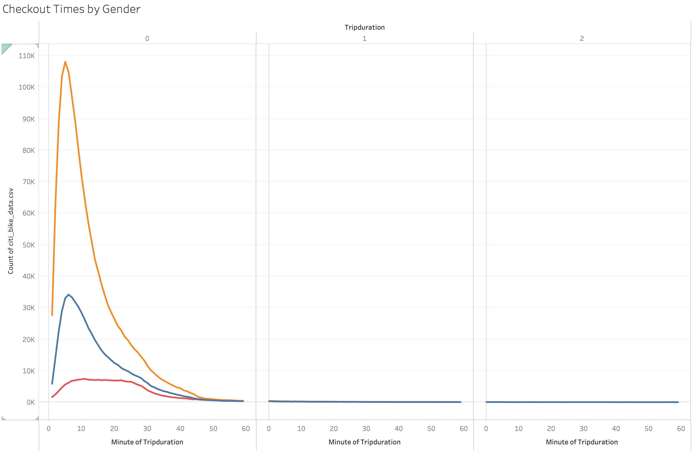
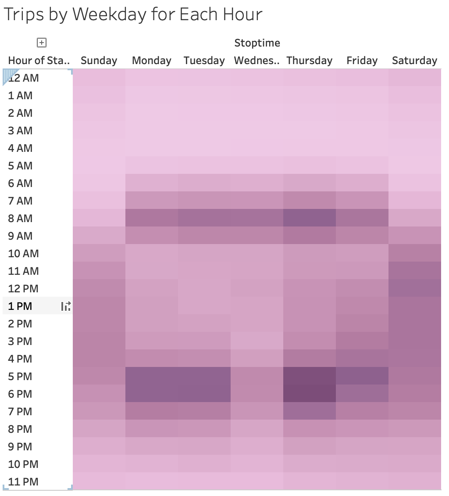
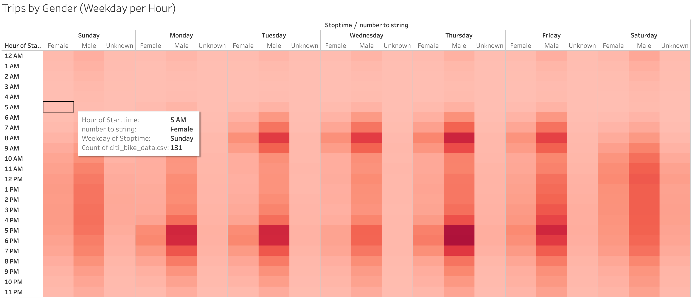
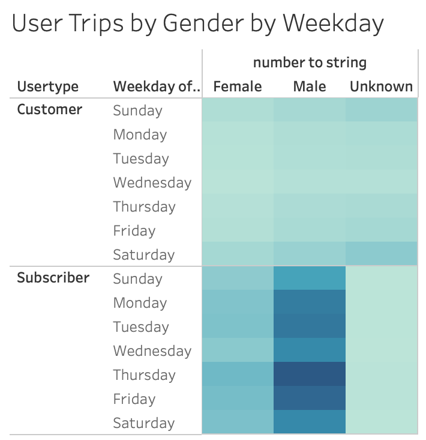

# 14bikesharing
# Overview of Project

With this project, I tasked with analyzing Citi Bike data in order to make visualizations for a board of investors thinking about bringing Citi Bikes to the city of Des Moines Iowa. 

## Purpose
The complete purpose of this project was to make creative visualizations so that the data in a csv file was digestible to people who've never written a line of code, like our investors. The visualizations i created are as follows:

  1. Checkout Times for Users
  2. Checkout Times by Gender
  3. Trips by Weekday for Each Hour
  4. Trips by Gender (Weekday per Hour)
  5. Users Trips by Gender by Weekday

# Results
Through creating the vizulizations listed above I was able to draw clear trends and conclusions

## Analysis
- Checkout Times for Users: I was able to conclude that an overwhelming amount of trips last less than 20 minutes

- Checkout Times by Gender: Here we can see that men checkout bikes almost 3 times as much as woman but more or less have the same trip duration

- Trips by Weekday for Each Hour: I concluded that the most popular hours for people to pick up a Citi Bike is during commute hours (6-8am and 5-7pm) which makes perfect sense.

- Trips by Gender (Weekday per Hour): Here we have a similar conclusion to the last vizualization. Bikes are driven primarily during usual commute hours and just like the "Checkout Times by Gender" viz shows, user type for Citi Bikes is primarily male.

- Users Trips by Gender by Weekday: We can see thst males are the dominant user type and the most popular days to ride are Thursday and Friday

## Summary

Based on the data set, we were able to see clear trends that can help the investors make predictions and decisions. When in Iowa, Citi Bikes marketing should be more geared towards a male audience, as many bikes as possible should be available during commute hours. The investors could even take a look at our top starting and ending locations to see what type of places most likely need to have bikes around at certain times. I believe that I could've furthered my analysys by what ages of users were most popular in order to see what age group the company should be advertising to. I also believe I could've made more vizualizations concerning bike matainence.
